# Exercise 09 - Genericita a výjimky

Cílem cvičení je procvičení genericity a výjimek na komplexním příkladu. V rámci příkladu jsou vytvořeny dvě abstraktní datové struktury - binární halda a hashovací tabulka. Tyto datové struktury neimplementují standardní rozhraní kolekcí z knihovny C#.

Binární halda představuje adresovatelnou binární haldu, kde je možné zpřístupnit a odebrat libovolný prvek se složitostí O(log n). Binární halda je typicky implementována implicitně na poli (jedná se o binární strom uložený do pole, nevytváří se tak organizační prvky s explicitními referencemi, ale využívá se specifického uspořádání v poli). Halda může být realizována jako 0-based i jako 1-based (typičtější v literatuře). Předchozí hodnota označuje index v poli, kde se nachází kořen haldy, u 1-based haldy je tedy v poli první prvek (nultý index) nevyužit. U 0-based platí, že potomci prvku ```i``` jsou na indexech ```(i*2)+1``` a ```(i*2)+2```, rodič prvku je pak na indexu ```(i-1)/2```. Pro 1-based platí, že potomci prvku ```i``` jsou na indexech ```i*2``` a ```i*2+1```, rodič prvku je pak na indexu ```i/2```. Vytvořená datová struktura je abstraktní a umožňuje ukládání libovolných dat a dle použité specifické třídy může reprezentovat min-haldu (kořen je minimální prvek z haldy, prvky jsou odebírány v pořadí od nejmenšího) i max-haldu (kořen je maximální prvek z haldy, prvky jsou odebírány v pořadí od největšího). Detaily algoritmů lze nalézt například na:
* https://www.algoritmy.net/article/15/Binarni-halda (1-based binární halda pro celá čísla)
* https://en.wikipedia.org/wiki/Binary_heap
* https://www.geeksforgeeks.org/binary-heap/ (0-based heap)
* https://visualgo.net/en/heap (vizuální animace operací nad haldou)

Hashovací tabulka představuje standardní hashovací tabulku s řešením kolizí pomocí zřetězení. Tabulka navíc disponuje min-haldou a max-haldou a umožňuje zpřístupnit minimální a maximální hodnotu klíče uloženého v tabulce se složitostí O(1). Složitost operací přidání a odebrání prvku je kvůli haldám "zhoršena" na O(log n) (klíč je nutné přidat/odebrat do/z min-haldy a max-haldy při každé změně v tabulce). Operace zjištění přítomnosti klíče v tabulce a zpřístupnění hodnoty dle klíče disponuje standardní složitostí O(1). Detaily algoritmů lze nalézt například na:
* https://www.geeksforgeeks.org/implementing-our-own-hash-table-with-separate-chaining-in-java/
* https://en.wikipedia.org/wiki/Hash_table#Separate_chaining
* https://www.algolist.net/Data_structures/Hash_table/Chaining
* https://visualgo.net/en/hashtable (varianta - separate chaining, vizuální animace operací nad hashovací tabulkou)

Výše uvedené výpočetní složitosti jsou průměrné (amortizované) a dle O notace zachovávají pouze nejsložitější člen výpočetní složitosti.

## Postup

* V projektu **GenericsHashTableLibrary** ve jmenném prostoru **GenericsHashTableLibrary** proveďte...
* vytvořte generickou třídu ```HeapHandle<T>```
    * tato třída slouží jako referenční (adresační) prvek do haldy a obsahuje příslušný klíč a adresu (index), kde je prvek v haldě umístěn
    * ```T``` splňuje omezení ```IComparable<T>```
    * vlasnosti:
        * ```T Key``` (lze číst a jednorázově nastavit)
        * ```int? Index``` (lze číst; nastavovat lze pouze v rámci sestavení)
    * parametrický konstruktor (key, index)
* vytvořte generické rozhraní ```IAddresableHeap<T>```
    * rozhraní popisuje adresovatelnou haldu
    * vlastnosti:
        * ```int Count``` (lze číst)
        * ```HeapHandle<T> Top``` (lze číst)
    * metody:
        * ```HeapHandle<T> Add(T key)```
        * ```void Remove(HeapHandle<T> handle)```
* vytvořte abstraktní generickou třídu ```AddresableBinaryHeap<T>```
    * ```T``` splňuje omezení ```IComparable<T>```
    * třída realizuje rozhraní ```IAddresableHeap<T>```
    * třída obsahuje abstraktní metodu ```int CompareKeys(T key1, T key2)```
        * metoda slouží pro porovnávání klíčů, konkrétní způsob bude zvolen v potomcích třídy
    * poznámky k implementaci
        * haldu implementujte jako binární haldu na poli
        * jelikož se jedná o adresovatelnou haldu, prvek pole není ```T?```, ale ```HeapHandle<T>?```
            * každý handle obsahuje informaci na kterém indexu daná data jsou - toto je nutné aktualizovat při každé reorganizaci vnitřní struktury haldy
        * pro účely ladění si lze vytvořit pomocnou metodu, která ověří, že je splněno haldové uspořádání - to musí platit po každé dokončené operaci ```Add``` i ```Remove``` (rekurzivní implementace i naivní iterativní implementace na ověření haldy může narazit na problém s jednotkovými testy! testy ověřují chování haldy i při velmi velkém počtu prvků a provádění testů tak může být extrémně pomalé nebo padat na StackOverflowException)
            * test ```ComplexUglyHeapWithNonTopRemovalsTest``` může za běžných okolností trvat řádově jednotky sekund
        * pole rozšiřujte podle potřeby přidávaných prvků, pole není třeba redukovat při snížení počtu prvků
        * haldu je možné implementovat jako 0-based i jako 1-based (první prvek je na indexu 1 v poli)
        * třída obsahuje bezparametrický konstruktor
        * ```Top``` vrací vrchol haldy; pokud je halda prázdná vyvolává výjimku ```InvalidOperationException```
        * ```Add``` přidá prvek na konec haldy a probublá ho směrem k vrcholu
        * ```Remove``` umožňuje odebírat i nekořenové prvky haldy
            * pokud se nejedná o kořen, tak je vybraný prvek násilně probublán na kořen (postupné výměny s rodičovskými prvky bez ohledu na skutečné hodnoty klíčů)
            * odebrání kořene postupuje klasicky - kořen je nahrazen listem z konce haldy a ten je probublán směrem k listům
            * prvek, který byl z haldy odebrán má ve svém ```HeapHandle``` nastaven ```Index``` na ```null```
* vytvořte generickou třídu ```MinAddresableBinaryHeap<T>```
    * třída dědí z ```AddresableBinaryHeap<T>```
    * ```T``` splňuje omezení definované předkem
    * implementace metody ```CompareKeys``` vrací výsledek operace ```key1.CompareTo(key2)```
* vytvořte generickou třídu ```MaxAddresableBinaryHeap<T>```
    * třída dědí z ```AddresableBinaryHeap<T>```
    * ```T``` splňuje omezení definované předkem
    * implementace metody ```CompareKeys``` vrací výsledek operace ```key2.CompareTo(key1)```
* vytvořte generickou třídu ```MinMaxHashTable<TKey, TValue>```
    * ```T``` splňuje omezení ```IComparable<Key>```
    * hashovací tabulka obsahuje min-haldu, max-haldu a pole pro uložení hashovací tabulky využívající zřetězení pro řešení kolizí
        * při přidání prvku
            * je klíč přidán do min-haldy
            * je klíč přidán do max-haldy
            * je prvek (klíč + hodnota + handle min-haldy + handle max-haldy) přidán do hash tabulky do pole, index se vypočítá dle ```GetHashCode```
        * při odebrání prvku - obdobně - prvek a klíče jsou odebrány ze všech struktur
        * řešení kolizí zřetězením znamená, že pokud více klíčů sdílí stejný vypočítaný index do pole, pak jsou všechny tyto prvky uloženy do spojového seznamu na daném indexu v poli
            * prakticky se nemusí jedna o spojový seznam, ale o pole; lze se také setkat s pojmy overflow list, bucket či bag
            * pole pro uložení tabulky pak může být třeba typu ```OverflowList[]```, kde ```OverflowList``` obsahuje ```HashTableEntry[]```, kde ```HashTableEntry``` obsahuje příslušné ```TKey```, ```TValue```, ```HeapHandle``` pro min-heap, ```HeapHandle``` pro max-heap
            * pole stačí alokovat při vzniku objektu tabulky, není potřeba pole realokovat (realokace by znamenala nutnost kompletní restrukturalizace tabulky), lze užít velikost pole například mezi 16 až 256 prvky, testy záměrně obsahují kolizní hashe, i při nekonečně velkém poli dojde k testování kolizí
        * pro realizaci tabulky není dovoleno použít třídy ```Dictionary```, ```HashSet```
        *  k dispozici je sada jednotkových testů ověřující základní i komplexní chování tabulky
            * test ```ComplexHashTableIncludingMinAndMaxTest``` může za běžných okolností trvat řádově jednotky sekund
    * vlastnosti
        * ```TKey Minimum``` - vrací minimální klíč v tabulce (dle kořene min-haldy)
            * pokud je tabulka prázdná - čtení vlastnosti vyvolá výjinku ```InvalidOperationException```
        * ```TKey Maximum``` - vrací maximální klíč v tabulce (dle kořene max-haldy)
            * pokud je tabulka prázdná - čtení vlastnosti vyvolá výjinku ```InvalidOperationException```
    * metody
        * bezparametrický konstruktor
        * ```void Add(TKey key, TValue value)```
            * přidá klíč-hodnotu do tabulky
            * pokud je klíč ```null```, vyvolá ```ArgumentNullException``` 
            * pokud je klíč v tabulce již obsažen, vyvolá ```ArgumentException```
            * přidá klíč do min-heap a max-heap
            * pokusí se prvek přidat do spojového seznamu/pole na pozici ```key.GetHashCode() % tableArray.Length```
                * kolize řeší zřetězením
        * ```bool Contains(TKey key)```
            * vrací ```true``` pokud je klíč v tabulce
            * pokud je klíč ```null```, vyvolá ```ArgumentNullException```
        * ```TValue Get(TKey key)```
            * vrací ```TValue``` pro příslušný klíč ```TKey```
            * pokud je klíč ```null```, vyvolá ```ArgumentNullException```
            * pokud se klíč v tabulce nenachází, vyvolá ```KeyNotFoundException```
        * ```TValue Remove(TKey key)```
            * odebere prvek z tabulky a vrátí příslušnou ```TValue```
            * pokud je klíč ```null```, vyvolá ```ArgumentNullException```
            * pokud se klíč v tabulce nenachází, vyvolá ```KeyNotFoundException```

## UML diagram - základní rozhraní
Na diagramu jsou vynechány členy, které jsou implementovány v předcích tříd. Diagram neobsahuje implementační detaily, ale pouze předepsaná rozhraní a metody.



## UML diagram - detaily možné implementace 
Diagram zobrazuje detaily možné implementace, konkrétní implementace nemusí tento diagram kopírovat, důležité je splnění rozhraní a funkcionality (viz předchozí diagram a popis).

